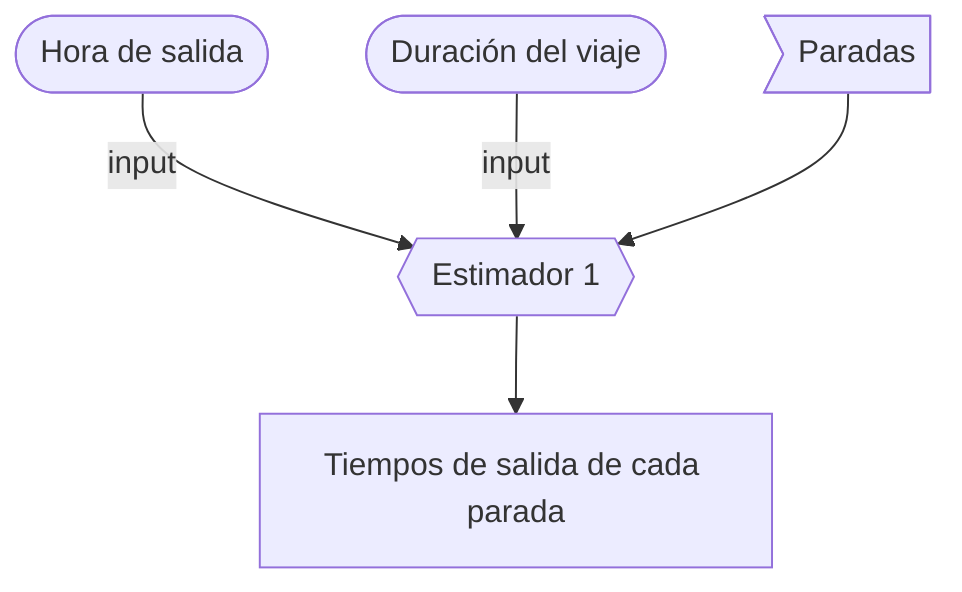
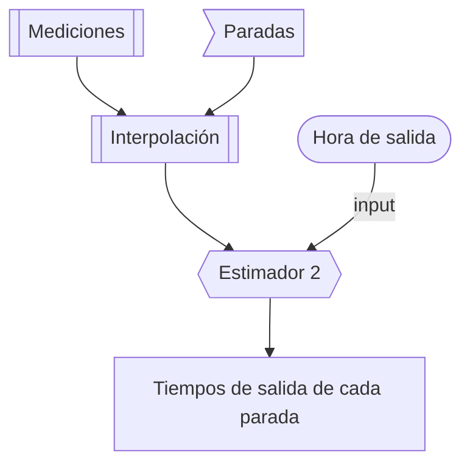
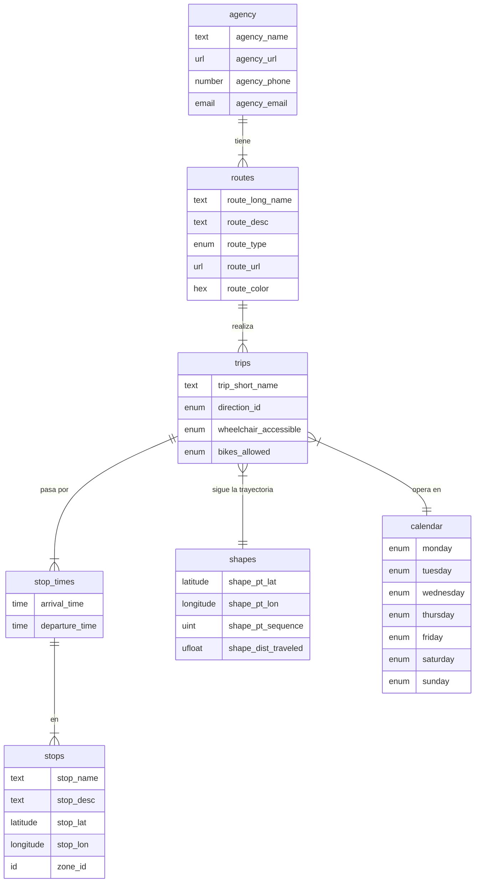
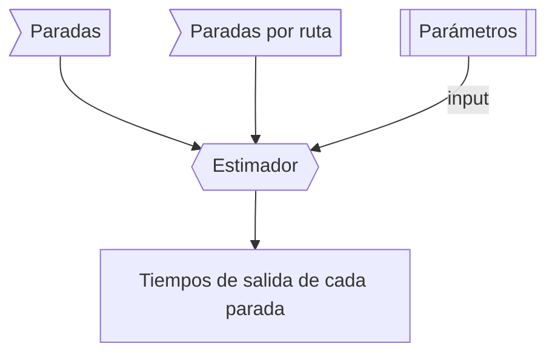

# Editor de datos GTFS *Schedule*

> Esta es una plataforma web para la edición de datos GTFS *Schedule*. Incluye los datos especificados en la [referencia GTFS v2.0](https://gtfs.org/schedule/reference/). Como adaptación especial para Costa Rica, el editor construye automáticamente los horarios de viajes de rutas de autobús en la tabla `stop_times` de GTFS (que usualmente consiste en muchos miles de líneas), a partir de una estimación de los tiempos de llegada y salida de todas las paradas en el viaje, a partir de la especificación de la hora de salida del viaje y otros parámetros.

## Premisas y contexto

- Los horarios de autobús cambian constantemente. 
- En Costa Rica esta información es especificada como una tabla de **horarios de salida de cada viaje**.
- GTFS, en cambio, maneja esta misma información como **horarios de llegada y salida de *cada parada* para cada viaje**.
- Lo anterior resulta, generalmente, en tablas de miles de entradas y por tanto es difícil de editar, incluso para cambios menores.
- Es más común conocer solamente la **hora de salida** y la **duración del viaje**. Con esta información y el conocimiento de la trayectoria del autobús y la ubicación de las paradas es posible hacer estimaciones de los tiempos de llegada y salida de las otras paradas intermedias.
- Es posible también hacer estudios de duración de los viajes. Por ejemplo, con un dispositivo GPS registrando el paso por cada parada en varios viajes.
- Es necesario crear estrategias de adaptación dinámica a los cambios de horarios.

### Definiciones

<dl>
  <dt>Parada o parabús</dt>
  <dd>Punto en la trayectoria de cada viaje donde el vehículo está autorizado a detenerse para subir o bajar personas.</dd>
  <dt>Tramo</dt>
  <dd>Segmento de la trayectoria entre una parada y la siguiente.</dd>
  <dt>Terminal</dt>
  <dd>Punto final o inicial de la trayectoria de un viaje (puede o no ser una parada).</dd>
</dl>

## Métodos de edición

Por lo expuesto, se proponen dos formas de ingresar la información:

1. **Definiendo la duración total del viaje y dividiendo los tiempos de forma proporcional a la distancia entre paradas, es decir, la longitud de cada tramo.**
    - "Paradas" es información de las tablas `stops` y `route_stops`, una tabla de referencia introducida más adelante.
    - Cada tramo puede tener, opcionalmete, un factor de peso, para denotar el hecho de que no todos los tramos se recorren a la misma velocidad promedio. 
    - Es posible también "zonificar" por tramos (ejemplo: rural, urbano, autopista), para ajustar el factor de peso.

2. **Creando una función de estimación a partir de mediciones de tiempos de llegada y salida de cada parada.**
    - "Paradas" es información de las tablas `stops` y `route_stops`, una tabla de referencia introducida más adelante.
    - Mediciones hechas en distintos días y distintas horas y que interpolan los tiempos de llegada según la hora del día.
    - La distancia entre paradas y la congestión (equivalente a la zonificación, propuesta arriba: rural, urbana, autopista) están implícitas en las mediciones. 
    - El ajuste de curva de interpolación puede ser polinomial.

La propuesta 1. es útil para un primer escenario donde no hay mediciones hechas. La propuesta 2. es más sofisticada y (posiblemente) entrega estimaciones más precisas que pueden irse refinando automáticamente con el tiempo, aun cuando hay cambios de horarios frecuentes.

## GTFS Schedule

El siguiente es un esbozo de la base de datos de GTFS, representado en un diagrama de entidad-relación ERD (no exhaustivo). Más información en [GTFS.org](https://gtfs.org/).

## Adaptaciones a GTFS

Para hacer posible la edición de los horarios descrita anteriormente, es necesario hacer dos tipos de adaptaciones a GTFS:

- Inclusión de **nuevos campos** en tablas existentes
- Creación de **nuevas tablas** de referencia

**Nota**: esto es posible y común de hacer. En ese caso, el *feed* GTFS sigue siendo compatible con Google Maps. Algunos de estos campos "experimentales" pueden llegar a ser parte del estándar.

### Nuevos campos en tablas existentes

Nuevos campos propuestos en `trips.txt`:

- `trip_departure_time`: indicación de la hora de salida (exacta) del viaje.
- `trip_arrival_time`: indicación de la hora de llegada (aproximada) del viaje.
- `trip_duration`: indicación de la duración (aproximada) del viaje.

### Nuevas tablas de referencia

Son *lookup tables* creados para mapear información que no está explícita en GTFS pero que es necesaria para construir programáticamente los datos que están en GTFS, como la tabla `stop_times`, en nuestro caso.

#### Tabla de paradas por cada viaje

- Generalmente, cada ruta tiene viajes en dos direcciones (en un sentido y en el otro).
- Generalmente, cada viaje en una dirección tiene una secuencia bien definida de paradas en una trayectoria (*shape*).
- En ciertos ejemplos, sin embargo, algunos viajes siguen una misma trayectoria pero con una secuencia *distinta* de paradas. Por ejemplo: expreso o colectivo.
- En otros ejemplos, "expreso" y "colectivo" tienen distintas trayectorias (y distintas paradas) y por tanto pueden considerarse rutas distintas.

> Es necesario crear una tabla que defina la secuencia de paradas que sigue cada viaje -o cada ruta, en el caso de que todos los viajes de una ruta tengan una misma trayectoria y misma secuencia de paradas, en ambas direcciones-.

Asumiendo que **cada ruta tendrá, por definición, una secuencia fija de paradas**, esta tabla puede ser llamada `route_stops`, para indicar que asigna paradas a cada ruta.

**Nota**: esta premisa debe ser un acuerdo para el sistema de transporte público. Una implicación inmediata, por ejemplo, es que un bus "colectivo" es una *ruta distinta* que un bus "express", que son una clasificación común de viajes de una misma "ruta", lo cual puede causar confusión.

Con esta tabla, la secuencia de creación de la tabla `stop_times` es, para ambas propuestas (explicadas arriba):

