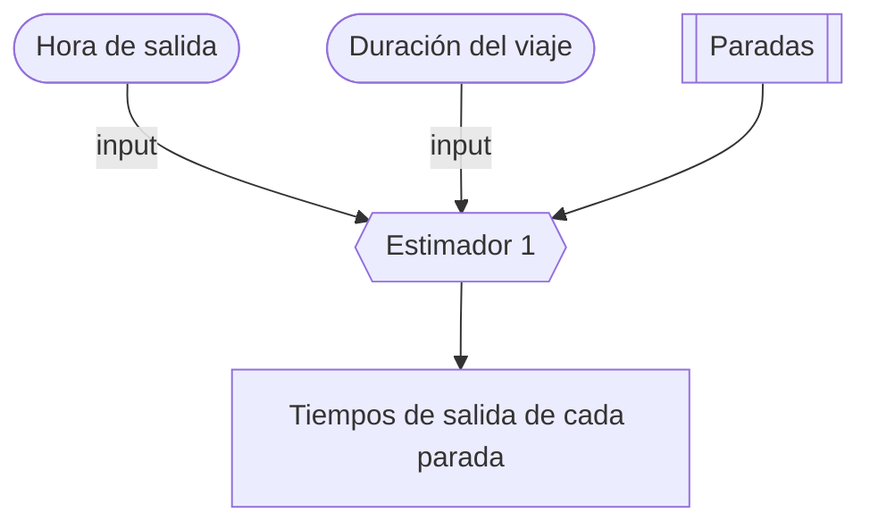
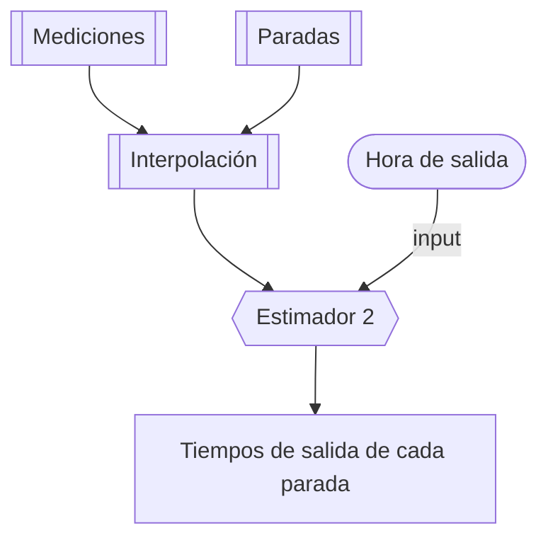

# Editor de horarios para GTFS
Descripción:

> Es una interfaz para la edición de horarios de viajes de rutas de autobús, especificando solamente la hora de salida y opcionalmente la duración del viaje. El programa genera un archivo `stop_times.txt` válido de GTFS con una estimación de los tiempos de salida del resto de paradas en el viaje.

## Premisas y contexto

- Los horarios de autobus cambian constantemente. 
- En Costa Rica esta información se especifica como una tabla de **horarios de salida de cada viaje**.
- GTFS maneja esta misma información como **horarios de salida de cada parada de cada viaje**.
- Lo anterior resulta, generalmente, en tablas de miles de entradas y por tanto es difícil de editar, incluso para cambios menores.
- Es más común conocer solamente la hora de salida y la duración del viaje. Con esto es posible hacer estimaciones de los tiempos de llegada y salida de las otras paradas.
- Es posible también hacer estudios de duración de los viajes, pero no es práctico hacerlo para todos los viajes.
- Es necesario crear estrategias de adaptación dinámica a los cambios de horarios.

Algunas definiciones:

- "Tramo": la trayectoria entre una parada y la siguiente.

## Métodos de edición

Por lo expuesto, se proponen dos formas de ingresar la información:

1. **Definiendo la duración total del viaje y dividiendo los tiempos de forma proporcional a la distancia entre paradas, es decir, la longitud de cada tramo.**
    - Cada tramo puede tener, opcionalmete, un factor de peso, para denotar el hecho de que no todos los tramos se recorren a la misma velocidad promedio. 
    - Es posible también "zonificar" por tramos (ejemplo: rural, urbano, autopista), para ajustar el factor de peso.

2. **Creando una función de estimación a partir de mediciones de tiempos de llegada y salida de cada parada.**
    - Mediciones hechas en distintos días y distintas horas y que interpolan los tiempos de llegada según la hora del día.
    - La distancia entre paradas y la congestión (equivalente a la zonificación, propuesta arriba: rural, urbana, autopista) están implícitas en las mediciones. 
    - El ajuste de curva de interpolación puede ser polinomial.

La propuesta 1. es útil para un primer escenario donde no hay mediciones. La propuesta 2. es más sofisticada y (posiblemente) entrega estimaciones más precisas que pueden irse refinando automáticamente con el tiempo.

## Adaptaciones a GTFS

Para hacer posible la edición de los horarios descrita anteriormente, es necesario hacer dos tipos de adaptaciones a GTFS:

- inclusión de nuevos campos en tablas existentes
- creación de nuevas tablas de referencia

**Nota**: esto es posible y común de hacer. El *feed* GTFS sigue siendo compatible con Google Maps.

### Nuevos campos en tablas existentes

Nuevos campos propuestos en `trips.txt`:

- `trip_departure_time`: indicación de la hora de salida (exacta) del viaje.
- `trip_arrival_time`: indicación de la hora de llegada (aproximada) del viaje.
- `trip_duration`: indicación de la duración (aproximada) del viaje.

### Nuevas tablas de referencia

Son *lookup tables* creados para mapear información que no está explícita en GTFS pero que es necesaria para construir programáticamente los datos que están en GTFS.

#### Tabla de paradas por cada viaje

- Generalmente, cada ruta tiene viajes en dos direcciones (en un sentido y en el otro).
- Generalmente, cada viaje en una dirección tiene una secuencia bien definida de paradas en una trayectoria (*shape*).
- A veces, sin embargo, algunos viajes siguen una misma trayectoria pero con una secuencia *distinta* de paradas. Por ejemplo: expreso o colectivo.
- En otros ejemplos, "expreso" y "colectivo" tienen distintas trayectorias (y distintas paradas) y por tanto pueden considerarse rutas distintas.

> Es necesario crear una tabla que defina la secuencia de paradas que sigue cada viaje -o cada ruta, en el caso de que todos los viajes de una ruta tengan una misma trayectoria y misma secuencia de paradas, en ambas direcciones-.
